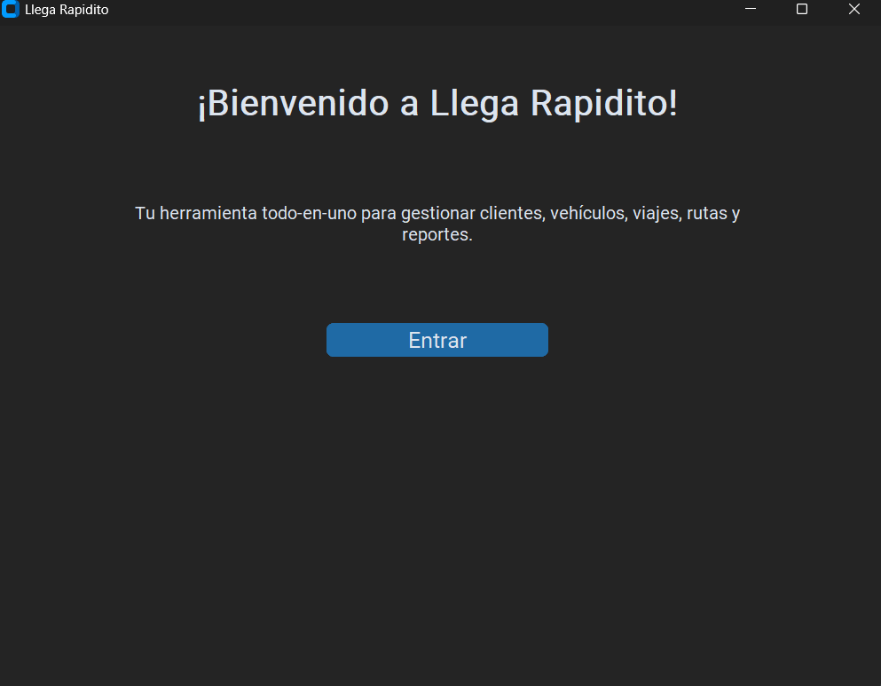
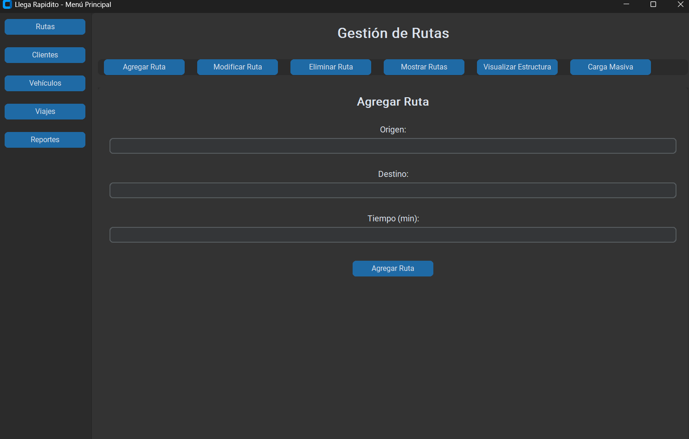
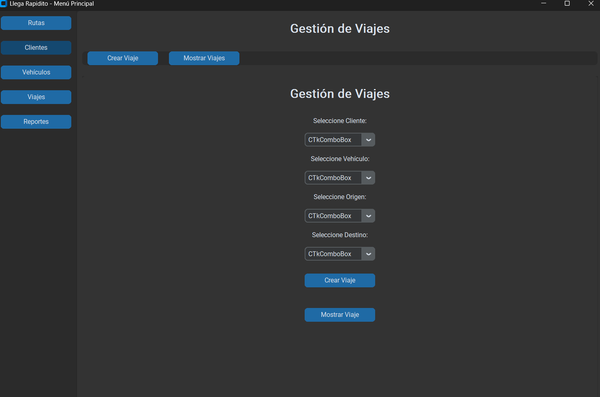
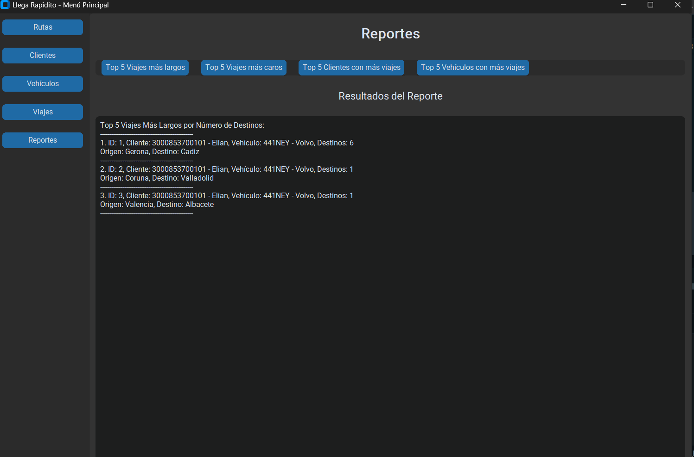

### **Manual de Usuario para la Aplicación de Gestión de Viajes "Llega Rapidito"**

---

### **Introducción**
"Llega Rapidito" es una aplicación que permite gestionar rutas, clientes, vehículos y viajes, brindando herramientas visuales y estadísticas para la administración eficiente de viajes y recursos. Este manual de usuario describe el funcionamiento de la interfaz gráfica y las funcionalidades principales.

---

### **Requisitos del Sistema**
- **Sistema Operativo**: Windows, MacOS o Linux.
- **Python**: Versión 3.9 o superior.
- **Dependencias Adicionales**:
  - `graphviz`
  - `customtkinter`
  - `PIL` (Pillow)

---

### **Inicio de Sesión**
1. **Ejecutar la aplicación**:
   Abra el archivo principal `GUI.py` en su entorno Python y ejecútelo.
2. **Pantalla de bienvenida**:
   - El mensaje "¡Bienvenido a Llega Rapidito!" aparecerá.
   - Haga clic en el botón "Entrar" para acceder al menú principal.

---

### **Menú Principal**
El menú principal ofrece cinco módulos principales, accesibles desde la barra lateral:

1. **Rutas**: Gestión de rutas entre diferentes destinos.
2. **Clientes**: Administración de clientes registrados.
3. **Vehículos**: Control de vehículos disponibles.
4. **Viajes**: Creación y visualización de viajes.
5. **Reportes**: Generación de estadísticas y reportes.


---

### **Funciones Principales**

#### **Gestión de Rutas**
- **Agregar Ruta**: Introduzca origen, destino y tiempo en minutos para crear una nueva ruta.
- **Modificar Ruta**: Seleccione una ruta existente y actualice el destino o tiempo.
- **Eliminar Ruta**: Elimine una ruta específica seleccionándola desde el menú.
- **Visualización**: Genere un gráfico visual de todas las rutas almacenadas.
- **Carga Masiva**: Importe múltiples rutas desde un archivo de texto.

```
# Ejemplo del archivo de entrada 
Quetzaltenango/Huehuetenango/90%
Quetzaltenango/San Marcos/75%
Quetzaltenango/Retalhuleu/85%
Huehuetenango/San Marcos/60%
Huehuetenango/Alta Verapaz/80%
San Marcos/Retalhuleu/50%
San Marcos/Mazatenango/70%
Retalhuleu/Mazatenango/40%
Retalhuleu/Escuintla/60%

```

#### **Gestión de Clientes**
- **Agregar Cliente**: Complete el formulario con datos del cliente, incluyendo DPI, nombre y dirección.
- **Modificar Cliente**: Seleccione un cliente y edite su información.
- **Eliminar Cliente**: Elimine un cliente ingresando su DPI.
- **Visualización**: Genere un gráfico visual de todos los clientes.
- **Carga Masiva**: Importe una lista de clientes desde un archivo de texto.

```
# Ejemplo del archivo de entrada 
1234567890123, Juan, Pérez, M, 555-1234, 123 Calle Principal;
2345678901234, María, López, F, 555-5678, 456 Avenida Secundaria;
3456789012345, Carlos, García, M, 555-9101, 789 Calle Tercera;
4567890123456, Ana, Martínez, F, 555-1121, 101 Calle Cuarta;
5678901234567, Luis, Rodríguez, M, 555-3141, 202 Avenida Quinta;
6789012345678, Laura, Hernández, F, 555-5161, 303 Calle Sexta;
7890123456789, José, González, M, 555-7181, 404 Avenida Séptima;
8901234567890, Elena, Sánchez, F, 555-9201, 505 Calle Octava;

```

#### **Gestión de Vehículos**
- **Agregar Vehículo**: Introduzca placa, marca, modelo y precio por segundo para registrar un vehículo.
- **Modificar Vehículo**: Actualice los datos de un vehículo seleccionado.
- **Eliminar Vehículo**: Elimine un vehículo especificando su placa.
- **Visualización**: Genere un gráfico visual del árbol B que almacena los vehículos.
- **Carga Masiva**: Importe una lista de vehículos desde un archivo de texto.

```
# Ejemplo del archivo de entrada 
P0123ABC:Toyota:Corolla:23.5;
P0456DEF:Honda:Civic:22.0;
P0789GHI:Ford:Focus:21.5;
P0123JKL:Chevrolet:Cruze:24.0;
P0456MNO:Nissan:Sentra:23.0;
P0789PQR:Hyundai:Elantra:22.5;
P0123STU:Kia:Optima:24.5;
P0456VWX:Volkswagen:Jetta:25.0;
P0789YZA:Subaru:Impreza:23.5;
P0123BCD:Mazda:3:24.0;

```

#### **Gestión de Viajes**
- **Crear Viaje**:
  - Seleccione cliente, vehículo, origen y destino.
  - Calcule automáticamente la ruta más corta entre los puntos seleccionados.
- **Mostrar Viajes**:
  - Visualice una lista de todos los viajes creados.
  - Genere gráficos de las rutas y estadísticas de tiempo.



#### **Reportes**
- **Viajes más largos**: Listado de los 5 viajes con más destinos.
- **Viajes más caros**: Top 5 viajes con mayor tiempo total.
- **Clientes con más viajes**: Identifique a los clientes con mayor cantidad de viajes registrados.
- **Vehículos más utilizados**: Encuentre los vehículos con más viajes asignados.

---

### **Cierre de la Aplicación**
Para cerrar la aplicación, simplemente haga clic en el botón de cierre de la ventana. Todos los cambios realizados se reflejarán en la próxima ejecución.

---

### **Resolución de Problemas**
- **Error al cargar archivos**: Verifique que el archivo de entrada siga el formato requerido.
- **Datos no visibles en gráficos**: Asegúrese de que existan datos registrados antes de generar visualizaciones.
- **Problemas con dependencias**: Ejecute `pip install -r requirements.txt` para instalar las bibliotecas necesarias.

---

### **Contacto de Soporte**
Si necesita ayuda adicional, contacte al desarrollador:
Daniel Andreé Hernandez Flores - 202300512
